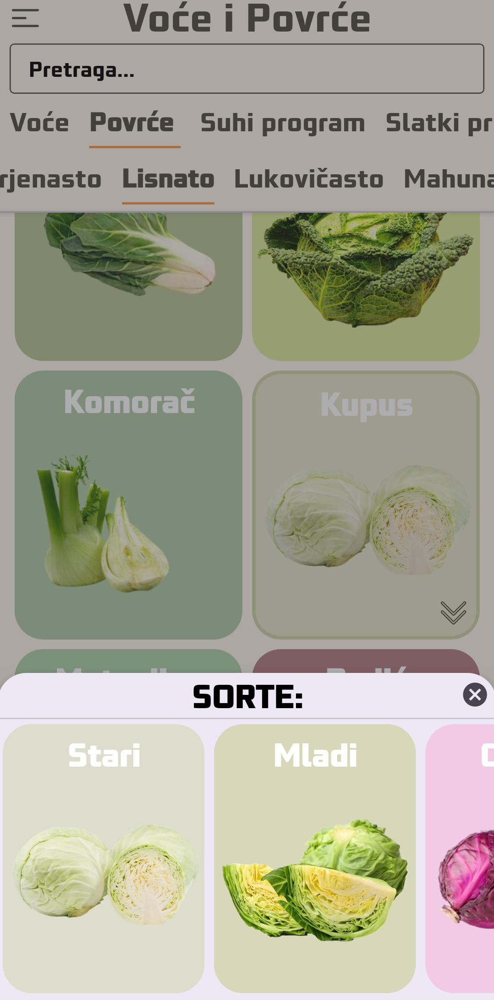

<h1 align="center"><code>APLIKACIJA ZA PRIJEM I KONTROLU KVALITETE VOĆA I POVRĆA</code></h1>
<table align="center">
  <tr>
    <tr>
    <td><a href="#cilj">CILJ</a></td>
    <td><a href="#funkcije"> FUNKCIONALNOST APLIKACIJE </a> </td>
    <td><a href="#prednosti">PREDNOSTI APLIKACIJE</a></td>
    <td><a href="#plan">PLAN RAZVOJA</a></td>
    <td><a href="#finalword">ZAKLJUČAK</a></td>
    <td><a href="#screenshots">SCREENSHOTS</a> </td>
      </tr>
    </tr>
</table>

<!--- CILJ CILJ CILJ CILJ CILJ --->
<h2 align="center"><code> CILJ </code></h2>

Razviti inovativnu Android aplikaciju koja će zamijeniti postojeće procese kontrole kvaliteta voća i povrća u magacinima.
Aplikacija će eliminirati gubitak vremena na tradicionalno pisanje u sveske i ručni unos podataka, pružiti preciznu kontrolu kvaliteta te automatizirano praćenje fakturisanih i stvarnih količina.
  

<!--- FUNKCIJE FUNKCIJE FUNKCIJE --->

<h2 align="center"><code> FUNKCIONALNOST APLIKACIJE </code></h2>

### POČETNI ZASLON
- Po otvaranju aplikacije, korisnik će biti dočekan početnim zaslonom.
- Na početnom zaslonu vidjet će osnovne kategorije: "Voće", "Povrće", "Suhi program", "Slatki program".
- Kategorije su scrollable kako bi korisnik mogao pregledavati sve dostupne.

### ODABIR KATEGORIJE
- Korisnik može odabrati jednu od kategorija pomoću dodira na ekranu.

### PODKATEGORIJE
- Nakon odabira kategorije, korisnik će vidjeti popis podkategorija unutar te kategorije.
- Primjerice, unutar kategorije "Voće", podkategorije mogu biti "Jabučasto", "Bobičasto", itd.
- Podkategorije su scrollable.

### PREGLED PLODOVA U ODABRANOJ PODKATEGORIJI
- Nakon odabira određene podkategorije, prikazat će se sličica (thumbnail) plodova s njihovim imenima.
- Pregled plodova također je scrollable.

### DETALJI O PLODU / SORTI
- Kada korisnik dodirne određeni plod, u slučaju kada plod ima više sorti otvara se pomoćni prozor s sortama koje pripadaju tom plodu.
- Nakon odabira sorte ili ploda (koji nema više sorti) otvara se novi prozor sa detaljima o odabranom plodu/sorti.
- Detalji uključuju uslove prijema te sorte/ploda, unos dobavljača, šifru artikla, vrijeme unosa itd.

### UNOS PODATAKA
- Korisnik može unositi potrebne podatke, poput dobavljača, šifre artikla, vrijeme unosa itd., u predviđena polja.
- Dodano dugme za započinjanje prijema omogućuje korisnicima jednostavno započinjanje procesa prijema više vrsta robe prilikom jednog istovara.
- Prilikom odabira dobavljača i unosa osnovnih podataka o dostavljaču, korisnik može dodavati više vrsta proizvoda na istom ekranu.
- Omogućavanje bržeg i efikasnijeg unosa podataka tijekom istovara.

### KONTROLA KOLIČINE FAKTURISANO / DOSTAVLJENO
- U okviru detalja o plodu ili sorti, korisnik može unijeti količinu primljenu/dostavljenu za odabrani proizvod.
- Aplikacija će pratiti i prikazivati razliku između količine fakturisane i stvarne količine primljene/dostavljene.
- Automatsko generiranje zapisnika o manjku i lošem kvalitetu, smanjujući potrebu za ručnim izvještajima.

### SPREMANJE PODATAKA
- Nakon unosa svih potrebnih podataka, korisnik može spremiti podatke, čime se ažurira baza podataka.

### NAVIGACIJA UNATRAG
- Korisnik može lako navigirati unatrag kako bi se vratio na prethodne ekrane i kategorije.

### OSTALE FUNKCIONALNOSTI
- Aplikacija može imati dodatne funkcionalnosti poput pretraživanja, filtriranja, izvještaja, obavijesti itd.
- Automatsko prepoznavanje proizvoda: Integracija s tehnologijama prepoznavanja slika kako bi aplikacija automatski prepoznala proizvode na temelju slika.
- Upravljanje zalihama: Dodajte funkcionalnost za praćenje stanja zaliha, automatsko obavještavanje o potrebama za obnavljanjem zaliha.
- Analitika i izvještaji: Uključivanje alata za generiranje izvještaja o prijemu, izlazu, zalihama, kako bi se olakšalo praćenje poslovanja.
- Integracija s ERP sustavima: Ako je primjenjivo, integracija s ERP sustavima (Enterprise Resource Planning) za bolje upravljanje podacima o poslovanju.
- Sustav obavijesti: Uključivanje sustava obavijesti za informiranje korisnika o važnim događajima, kao što su istek garancije, niske zalihe itd.
- Dodatne sigurnosne značajke: Poboljšanje sigurnosti aplikacije, uključujući autentikaciju, šifriranje podataka i zaštitu privatnosti.

 
<!--- PREDNOSTI PREDNOSTI PREDNOSTI --->
<h2 align="center"><code> PREDNOSTI APLIKACIJE </code></h2>

### EFIKASNOST I VREMENSKA UŠTEDA
- Zamjena tradicionalnih metoda s inovativnom tehnologijom automatskog prepoznavanja slika značajno ubrzava procese kontrole kvaliteta.
- Automatizirano generiranje zapisnika o manjku i lošem kvalitetu eliminira potrebu za ručnim pisanjem izvještaja, štedeći vrijeme korisnika.
- Brzo započinjanje procesa prijema putem intuitivnog sučelja ubrzava unos podataka i olakšava logističke operacije.

### SMANJENJE MOGUĆNOSTI GREŠAKA
- Automatizirani sustavi unosa podataka minimiziraju ljudsku intervenciju, smanjujući mogućnost grešaka pri unosu informacija.
- Standardizirani parametri kontrole kvaliteta eliminiraju subjektivnost u procjeni kvaliteta proizvoda, osiguravajući dosljednost.
- Baza slika i podataka pruža vizualnu potvrdu i olakšava praćenje povijesti svakog proizvoda, smanjujući nesporazume.

### TRANSPARENTNOST U PRAĆENJU ZALIHA
- Analitika i izvještaji omogućavaju korisnicima detaljan uvid u stanje zaliha, potražnju i potrošnju, olakšavajući informirane odluke.
- Automatsko praćenje fakturisanih i stvarnih količina smanjuje rizik od zaliha koje ne odgovaraju stvarnim potrebama.

### INOVATIVNE DODATNE FUNKCIONALNOSTI
- Tehnologija prepoznavanja slika i automatsko generiranje dokumentacije i izvještaja unapređuju korisničko iskustvo.
- Integracija s ERP sustavima pruža povezanost s ostalim poslovnim procesima, stvarajući ujedinjeni sustav upravljanja podacima.
- Analitički alati pridonose inovacijama u donošenju odluka, omogućavajući bolje razumijevanje performansi i potreba poslovanja.

### PRECIZNA PROVJERA KVALITETA
- Detaljni katalozi s uslovima prijema omogućuju postavljanje specifičnih parametara za svaki proizvod, osiguravajući dosljednu kvalitetu.
- Automatizirano praćenje parametara minimizira varijacije u kontroli kvaliteta, smanjujući rizik od grešaka i gubitaka.

### ANALITIKA I IZVJEŠTAJI
- Integrirani sustav analitike generira detaljne izvještaje o kontroli kvaliteta, pružajući uvid u performanse dobavljača
  i trendove kvaliteta proizvoda.
- Ovi izvještaji pomažu u informiranim odlukama o suradnji s dobavljačima i optimizaciji procesa prijema.

### BAZA SLIKA I PODATAKA SA PRIJEMA
- Moćna baza podataka sadržava slike i relevantne podatke o svakom primljenom proizvodu, pružajući brz pristup informacijama.
- Povezanost slika s podacima, uključujući uslove prijema, količinu, dobavljača i šifru artikla, olakšava praćenje i analizu podataka.

 
<!--- PLAN PLAN PLAN --->
<h2 align="center"><code> PLAN RAZVOJA </code></h2>
 
### 1. FAZA: PLANIRANJE
   - Definiranje ciljeva i svrhe aplikacije:
     - [x] Identificiranje osnovnih funkcionalnosti i ciljeva aplikacije. √
   - Analiza zahtjeva:
     - [x] Identificiranje sve tehničke i funkcionalne zahtjeve aplikacije. √
     - [x] Razgovar s budućim korisnicima kako bi dobili njihove povratne informacije. √
   - Analiza konkurencije:
     - [x] Proučiti slične aplikacije na tržištu i identificiranje njihove snage i slabosti. √
   - Definiranje budžeta i resursa:
     - [ ] Odrediti financijske resurse, vremenski okvir i timski sastav.
##

### 2. FAZA: DIZAJN
   - Kreiranje wireframe-a:
     - [x] Izraditi osnovni koncept korisničkog sučelja i korisničkog iskustva. √
   - Dizajniranje baze podataka:
     - [ ] Definiranje strukture baze podataka potrebnu za spremanje podataka o voću, povrću, dobavljačima itd.
   - UI/UX dizajn:
     - [ ] Razvijanje vizualnog dizajna aplikacije i korisničko sučelje.
     - [ ] Osigurajti intuitivnost i jednostavnost korištenja.
##

### 3. FAZA: IMPLEMENTACIJA
   - Razvoj backend-a:
     - [ ] Implementiranje serverske logiku za obradu podataka, autentikaciju i upravljanje bazom podataka.
   - Razvoj frontend-a:
     - [ ] Implementiranje korisničkog sučelje prema dizajnu i wireframe-ima.
   - Integracija funkcionalnosti:
     - [ ] Povezivanje backend i frontend kako bi aplikacija radila kao cjelina.
##

### 4. FAZA: TESTIRANJE
   - Unit testiranje:
     - [ ] Testiranje svake funkcionalnosti odvojeno kako bi se osigurala ispravnost.
   - Integracijsko testiranje:
     - [ ] Testiranje rada svih dijelova aplikacije zajedno.
   - Testiranje korisničkog iskustva:
     - [ ] Provjeriti kako korisnici reagiraju na aplikaciju i prikupiti povratne informacije.
##

### 5. FAZA: PUŠTANJE U RAD
   - Finalna revizija:
     - [ ] Provođenje konačne revizije aplikacije prije puštanja u rad.
   - Puštanje u rad:
     - [ ] Objaviti aplikaciju na Google Play Store-u ili lokalno ručno instaliranje na uređaje.
     - [ ] Osigurati podršku korisnicima i održavanje sustava.
##

### 6. FAZA: ODRŽAVANJE
   - Nadogradnje i ispravci:
     - [ ] Pratiti povratne informacije korisnika i ažuriranje aplikacije prema potrebi.
   - Praćenje performansi:
     - [ ] Redovito pratiti performanse sustava i optimizirati ih prema potrebi.
 

<!--- FINAL FINAL FINAL --->
<h2 align="center"><code> ZAKLJUČAK </code></h2>
Ova Android aplikacija ima potencijal potpuno transformirati procese kontrole kvaliteta voća i povrća, eliminirati gubitak vremena ismanjiti mogućnost
grešaka. Zamjenom tradicionalnih metoda, unaprijedit će ukupno poslovanje i transparentnost u upravljanju zalihama. Korisnici će dobiti alat koji ne samo
da će poboljšati njihove trenutačne procese, već će također donijeti učinkovitost i preciznost u radu, omogućujući im da se fokusiraju na ključne aspekte
njihovog poslovanja. Ova aplikacija predstavlja budućnost u upravljanju kvalitetom proizvoda u skladištima, donoseći inovaciju i poboljšanja koja će imati
dugoročan utjecaj na operativnu učinkovitost.

 
<!--- SCREENSHOTS SCREENSHOTS SCREENSHOTS --->
<h2 align="center"><code> SCREENSHOTS </code></h2>

<!-- HOME SCREEN --->

  <table align="center">
    <tr>
      <tr>
          <td>
HOME SCREEN 1
</td>
          <td>
HOME SCREEN 2
</td>
        </tr>
      <td></td>
      <td></td>
    </tr>
  </table>

  <table>
    <tr>
      <tr>
        <td align="center" width="33.3%">KATEGORIJE</td>
        <td align="center" width="33.3%">SORTE</td>
        <td align="center" width="33.3%">SORTE + SEARCH</td>
      </tr>
    <td></td>
    <td></td>
    <td></td>
  </tr>
</table>

  <table align="center">
    <tr>
      <tr>
          <td>
DETALJI ARTIKLA-SORTE 1/2
</td>
          <td>
DETALJI ARTIKLA-SORTE 2/2
</td>
        </tr>
      <td></td>
      <td></td>
    </tr>
  </table>

  <table align="center">
    <tr>
      <tr>
          <td>
NAJAVLJENE ISPORUKE
</td>
          <td>
NAJAVLJENE ISPORUKE - DETALJI NAJAVE
</td>
        </tr>
      <td></td>
      <td></td>
    </tr>
  </table>

 
<!--- AUTOR AUTOR AUTOR --->

<h2 align="center"><code> AUTOR </code></h2>

[Silvio Suljić](https://github.com/Silv3rVIP)

 
<!--- LICENCE LICENCE LICENCE --->

<h2 align="center"><code> LICENCE </code></h2>

